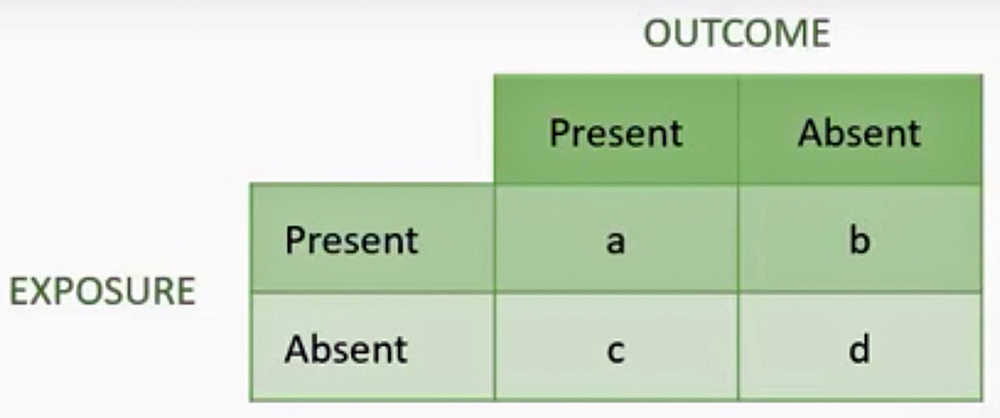

[Click Here](https://select-statistics.co.uk/calculators/confidence-interval-calculator-odds-ratio/)"Odds ratio – Confidence Interval"

# What is a Contingency Table?

A contingency table summarises the outcomes of each individual sampled in terms of whether Properties (A - Exposure) and (B - Outcome) are absent or present. It represents the joint frequency distribution of the two properties.



Data from case-control studies (retrospective or prospecitve) can be analyzed in several ways.

# Odds Ratio
An odds ratio is a measure of association between the presence or absence of two properties.

## Smoking and Cancer

In 1950, the Medical Research Council conducted a case-control study of smoking and lung cancer (Doll and Hill 1950).

Let's create a 2 X 2 table of the results.

```{r}
CT <- matrix(c(647, 2, 622, 27), nrow = 2)
rownames(CT) <- c("Smoker", "Non-Smoker")
colnames(CT) <- c("Cancer", "No-Cancer")
CT
```
# Load R packages

```{r}
suppressMessages(library(oddsratio))
suppressMessages(library(questionr))
suppressMessages(library(DescTools))
# suppressMessages(library(epitools))
suppressMessages(library(fmsb))
```
# Analysis

### OR = ad/bc = (647 x 27) / (622 x 2) 

```{r}
a <- CT[1]
c <- CT[2]
b <- CT[3]
d <- CT[4]
(647 * 27) / (622 * 2) 
OR <- round((a*d)/(b*c),2)
OR
```
The odds of lung cancer in smokers is estimated to be 14 times the odds of lung cancer in non-smokers. How reliable is this estimate?
We need to calculate a confidence interval. If the study is repeated and the range calculated each time, you would expect the true value to lie within these ranges on 95% of trials.


```{r}
OddsRatio(CT[1:2,], method="wald", 
      conf.level=0.95)
```
The 95% confidence interval for this odds ratio is between 3.33 and 59.3. Why such a huge range? It's because the numbers of non-smokers, particularly for lung cancer cases, are very small. Increasing the confidence level to 99% this interval would increase to between 2.11 and 93.25.

```{r}
OddsRatio(CT[1:2,], method="wald", 
      conf.level=0.99)
```

# Interpretation of case/control study

Patients with cancer or 14 times more likely to have been smokers than non-smokers.


### Details of the CI algorithm

```{r}
log_OR <-log((a*d)/(b*c))
log_OR
std_log_OR <- sqrt(1/a + 1/b + 1/c +1/d)
std_log_OR
# Two tailed Z = 1.96, alpha = 0.05
ci_ll <-round(exp(log_OR - 1.96 * std_log_OR),2)
# ci_ll
ci_ul <- round(exp(log_OR + 1.96 * std_log_OR),2)
# ci_ul
cat("The 95% CI ranges from",ci_ll,"to",ci_ul)
```

# Relative Risk

### RR = a/(a+b) / c(/c+d)

```{r}
RR <- (a/(a+b)) / (c/(c+d))
round(RR,2)
fmsb_RR <- riskratio(647, 2, 1269, 29, conf.level=0.95, p.calc.by.independence=TRUE) 
round(fmsb_RR$estimate,2)
round(fmsb_RR$conf.int,2)
```

### Interpretation of the RR

We are 95% confident that the relative risk of cancer in smokers compared to non-smokers is between 1.91 amd 28.19. The null value is 1. Since the 95% confidence interval does not include the null value (RR=1), the finding is statistically significant.

# Another study
Does chocolate consumtion reduce the risk of cardiovascular disease?

# Odds Ratio

```{r}
CT2 <- matrix(c(925, 1020, 168, 147), nrow = 2)
rownames(CT2) <- c("Chocolate","None")
colnames(CT2) <- c("CV Disease","No-CV Disease")
CT2
```

```{r}
odds.ratio(CT2)

```
The OR at 0.79 suggests that chocolate (1-3 times a month) has some protective effect.  But since the 95% confidence interval includes the null value of 1, the effect is not statistically significant.(p>0.05)

### What about chocolate more than 4 times a week?
```{r}
CT3<- matrix(c(43, 168, 736, 925), nrow = 2)
rownames(CT3) <- c("Choc","None")
colnames(CT3) <- c("CV Disease","No-CV Disease")
CT3
odds.ratio(CT3)
```
The OR at 0.32 suggests that chocolate (more than 4 times a week) has a protective effect.The 95% confidence interval does not include the null value of 1, thus the effect is statistically significant. The risk reduction = 1 - OR = 0.68 = 68%. (p<0)

# What abbut the Relative Risk?

```{r}
RRC <- (43/(43+736)) / (168/(168+925))
RRC
fmsb_RR2 <- riskratio(43, 168, 779, 1093, conf.level=0.95, p.calc.by.independence=TRUE)
round(fmsb_RR2$estimate,2)
round(fmsb_RR2$conf.int,2)
Percent_decrease <- (1 - RRC) * 100
Percent_decrease
```

# Interpretation

Those who ate chocolate more than 4 times a week have 0.36 times the risk of cardiovascular disease compared to those who didn't eat chocolate. Since the 95% confidence interval did not include 1, the result is statistically signiicant.

Chocolate eaters had a cumulative incidence of CV disease of 43/779 = 0.055 compared to 168/1093 = 0.154 for non-chocolate eaters.

The chocolate eaters had a 64% decrease in CV disease risk.

# What about a Chi Squared test?

[Click Here](https://medium.com/@nhan.tran/the-chi-square-statistic-p-1-37a8eb2f27bb)"Chi Squared Test"

Hypotheses of variabe independence

H0: The 2 variables are independent

HA: They are related

Do the test without Yates correcton.

```{r}
chisq.test(CT, correct=FALSE)
# Reject H0 (p<0.05)
chisq.test(CT2, correct=FALSE)
# Do not reject H0 (p>0.05)
chisq.test(CT3, correct=FALSE)
# Reject H0 (p<0.05)
```

# 2 x 2 Classification Table

Resulting from Logistic Regression, for example.

The four data counts represent true and false positives and true and false negatives.The analysis is done with a confusion matrix which provides many statistics including: total accuracy, sensitiviy, specificity, precsion, recall and F1-Score. And then one can proede to the Receiver Operating Characteristic (ROC) and Area Under the Curve (AUC) statistics.


[Click Here](https://physiology.med.cornell.edu/people/banfelder/qbio/resources_2009/2009_1.3%20Confidence%20Intervals%20and%20Contingency%20Tables.pdf)"Confidence Intervals"


[Click Here](https://taragonmd.github.io/2019/09/22/guide-for-setting-up-your-mac-os-to-write-technical-papers/)"Technical Papers"

[Click Here](https://github.com/taragonmd/angela)"Setup MAC to wirte technical papers"

[Click Here](https://psychscenehub.com/psychpedia/odds-ratio-2/)"Odds Ratio"

[Click Here](https://www.ncbi.nlm.nih.gov/pmc/articles/PMC1112884/)"Odds Raatios Mislead "

[Click Here](http://sphweb.bumc.bu.edu/otlt/MPH-Modules/EP/EP713_Association/EP713_Association3.html)"Association"

[Click Here](https://towardsdatascience.com/confusion-matrix-un-confused-1ba98dee0d7f)"Confusion Matrix"

[Click Here](https://medium.com/@neeraj.kumar.iitg/statistical-performance-measures-12bad66694b7)"Statistical Performance Measures"
